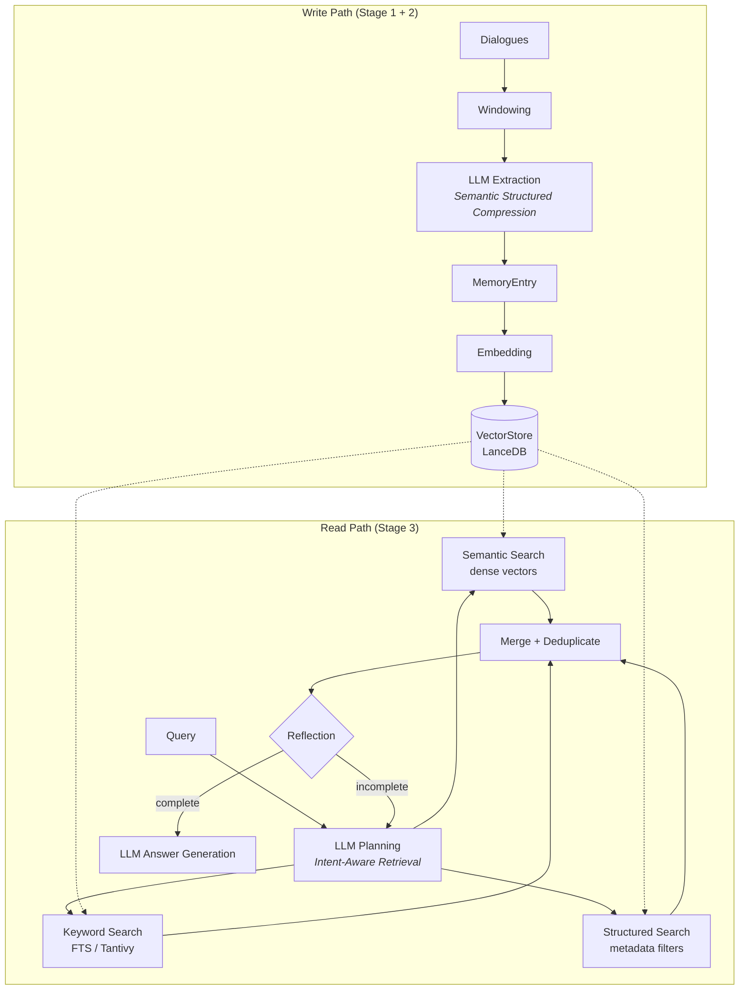

# meme

[![Crates.io][meme-crate]][meme-crate-url]
[![Documentation][meme-doc]][meme-doc-url]
[![CI][ci-badge]][ci-url]
[![License][license-badge]][license-url]
[![Rust][rust-badge]][rust-url]

[meme-crate]: https://img.shields.io/crates/v/meme.svg
[meme-crate-url]: https://crates.io/crates/meme
[meme-doc]: https://img.shields.io/docsrs/meme.svg
[meme-doc-url]: https://docs.rs/meme
[ci-badge]: https://github.com/qntx/meme/actions/workflows/rust.yml/badge.svg
[ci-url]: https://github.com/qntx/meme/actions/workflows/rust.yml
[license-badge]: https://img.shields.io/badge/license-MIT%2FApache--2.0-blue.svg
[license-url]: LICENSE-MIT
[rust-badge]: https://img.shields.io/badge/rust-edition%202024-orange.svg
[rust-url]: https://doc.rust-lang.org/edition-guide/

**High-performance long-term memory for AI agents — three-stage pipeline with semantic compression, hybrid retrieval, and persistent vector storage, written in Rust.**

meme implements the [SimpleMem](https://github.com/aiming-lab/SimpleMem) three-stage memory pipeline with a production-grade Rust core: (1) **Semantic Structured Compression** extracts lossless, disambiguated memory entries from dialogues via LLM, (2) **Online Semantic Synthesis** deduplicates at write time, and (3) **Intent-Aware Retrieval Planning** combines semantic, lexical (FTS), and structured metadata search with LLM-driven reflection. Memory is stored persistently on disk via LanceDB.

## Quick Start

### Install the CLI

**Shell** (macOS / Linux):

```sh
curl -fsSL https://sh.qntx.fun/meme | sh
```

**PowerShell** (Windows):

```powershell
irm https://sh.qntx.fun/meme/ps | iex
```

### CLI

```bash
# Initialize configuration
meme init

# Add dialogues
meme add -s Alice "I'll be in Tokyo next Monday for the conference."
meme add -s Bob "Let's meet at Shibuya station at 3pm."

# Import from JSONL file
meme add --file conversation.jsonl

# Ask questions
meme ask "Where will Alice and Bob meet?"

# List stored memories
meme list
meme list --json

# Export / import
meme export -o memories.json
```

### Library

```rust
use meme::MemeBuilder;

let meme = MemeBuilder::new()
    .api_key("sk-...")
    .model("gpt-4.1-mini")
    .build()
    .await?;

// Add dialogues — automatically extracted into structured memory entries.
meme.add_dialogue("Alice", "Let's meet at 2pm tomorrow", None).await?;
meme.add_dialogue("Bob", "Sure, I'll bring the Q3 report", None).await?;
meme.finalize().await?;

// Ask questions — hybrid retrieval + LLM answer generation.
let answer = meme.ask("When will Alice meet?").await?;
```

See [`examples/`](meme/examples/) for more: [basic](meme/examples/basic.rs), [batch import](meme/examples/batch_import.rs).

## Feature Flags

| Feature | Default | Description |
| --- | --- | --- |
| `api-embedding` | **yes** | Remote OpenAI-compatible embedding API |
| `onnx` | no | Local ONNX embedding via [`fastembed`](https://github.com/Anush008/fastembed-rs) — auto-downloads models from Hugging Face Hub |

## Configuration

**No configuration file is required.** The library is configured entirely through `MemeBuilder`:

```rust
let meme = MemeBuilder::new()
    .api_key("sk-...")
    .model("gpt-4.1-mini")
    .base_url("https://api.openai.com/v1")
    .build()
    .await?;
```

For full control, pass a `Config` struct directly:

```rust
use meme::config::{Config, LlmConfig, EmbeddingConfig, StoreConfig, PipelineConfig};

let config = Config {
    llm: LlmConfig { api_key: Some("sk-...".into()), ..Default::default() },
    embedding: EmbeddingConfig { model: "text-embedding-3-small".into(), dimension: 1024, ..Default::default() },
    store: StoreConfig { lancedb_path: "/custom/path/lancedb".into(), ..Default::default() },
    pipeline: PipelineConfig { semantic_top_k: 25, enable_reflection: true, ..Default::default() },
};

let meme = MemeBuilder::new().config(config).build().await?;
```

The CLI tool (`meme-cli`) optionally reads `~/.meme/config.toml`. Environment variables override any file or default values:

| Env Var | Overrides | Default |
| --- | --- | --- |
| `MEME_LLM_API_KEY` | `llm.api_key` | *(required)* |
| `MEME_LLM_BASE_URL` | `llm.base_url` | `https://api.openai.com/v1` |
| `MEME_LLM_MODEL` | `llm.model` | `gpt-4.1-mini` |
| `MEME_EMBEDDING_PROVIDER` | `embedding.provider` | `api` |

<details>
<summary><b>Full config.toml reference</b></summary>

```toml
[llm]
api_key = "sk-..."
base_url = "https://api.openai.com/v1"
model = "gpt-4.1-mini"
temperature = 0.1
max_retries = 3

[embedding]
provider = "api"                        # "api" or "onnx"
model = "text-embedding-3-small"        # API model name or fastembed model code
dimension = 1024                        # vector dimension (auto-detected for onnx)

[store]
lancedb_path = "~/.meme/lancedb"
table_name = "memories"

[pipeline]
window_size = 40                        # dialogues per extraction window
overlap_size = 2                        # overlap between consecutive windows
semantic_top_k = 25                     # max semantic search results
keyword_top_k = 5                       # max keyword search results
structured_top_k = 5                    # max structured search results
enable_planning = true                  # LLM-driven query analysis
enable_reflection = true                # iterative completeness checking
max_reflection_rounds = 2
max_build_workers = 16                  # parallel extraction workers
max_retrieval_workers = 8               # parallel search workers
```

</details>

## Architecture



Each `MemoryEntry` is a self-contained, unambiguous unit of knowledge stored with three index layers:

| Index Layer | Type | Purpose | Implementation |
| --- | --- | --- | --- |
| **Semantic** | Dense vector | Conceptual similarity | 1024-d embeddings via OpenAI or local ONNX |
| **Lexical** | Inverted index | Exact term matching | FTS (Tantivy) + BM25-style keywords |
| **Symbolic** | Structured metadata | Filtered lookup | Timestamp, location, persons, entities, topic |

## Three-Stage Pipeline

### Stage 1: Semantic Structured Compression

Raw dialogues are split into overlapping windows and sent to an LLM. The LLM extracts **atomic, self-contained memory entries** — each entry is a complete, independent fact with all pronouns resolved and all timestamps converted to absolute ISO 8601 format. This ensures every entry can be retrieved and understood without surrounding context.

Each entry contains:

- **Lossless restatement** — complete sentence (no pronouns, no relative time)
- **Keywords** — core terms for BM25-style lexical matching
- **Structured metadata** — ISO 8601 timestamp, location, person names, entity names, topic phrase

### Stage 2: Online Semantic Synthesis

During extraction, the previous window's entries are passed as context to the LLM. This prevents duplicating information across overlapping windows — the LLM can see what was already captured and focuses on new facts. Unlike offline consolidation systems that run as background jobs, this synthesis happens inline during the write path with zero additional latency.

### Stage 3: Intent-Aware Retrieval Planning

A single LLM call analyzes the user's query and produces a **unified retrieval plan**:

1. **Query analysis** — extract keywords, person names, entities, time expressions, and question type
2. **Search planning** — generate 1–3 targeted search queries for semantic retrieval
3. **Information requirements** — identify what specific facts are needed for a complete answer

The plan drives **parallel execution** of all three search layers (semantic, keyword, structured). Results are merged via ID-based deduplication.

When reflection is enabled, the system iteratively assesses completeness: if retrieved context is insufficient, additional targeted queries are generated and executed until the information requirement is satisfied or the max reflection rounds are reached.

## License

Licensed under either of:

- Apache License, Version 2.0 ([LICENSE-APACHE](LICENSE-APACHE) or <https://www.apache.org/licenses/LICENSE-2.0>)
- MIT License ([LICENSE-MIT](LICENSE-MIT) or <https://opensource.org/licenses/MIT>)

at your option.

Unless you explicitly state otherwise, any contribution intentionally submitted for inclusion in this project shall be dual-licensed as above, without any additional terms or conditions.

---

<div align="center">

A **[QNTX](https://qntx.fun)** open-source project.

<a href="https://qntx.fun"></a>

<!--prettier-ignore-->
Code is law. We write both.

</div>
